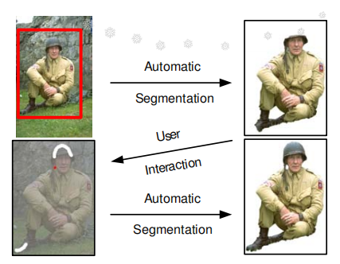
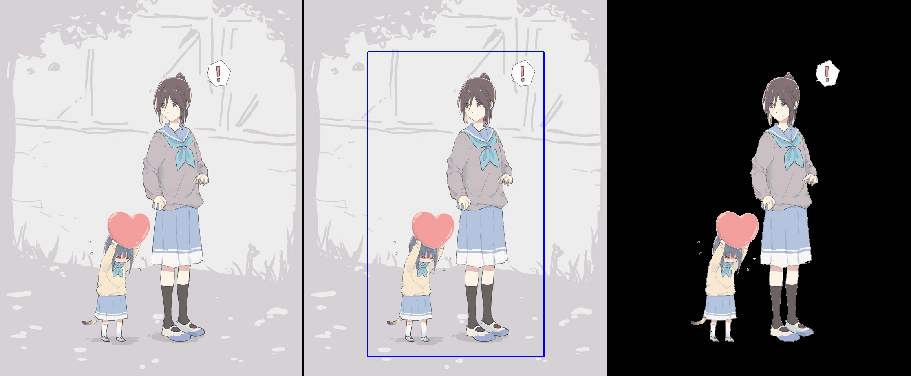
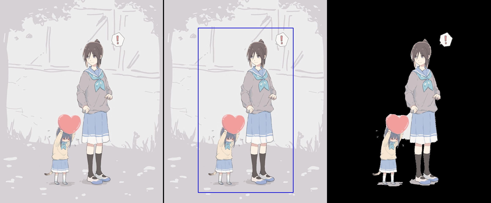

## **【Report】基于迭代图割算法的图像前景提取 GrabCut：Interactive Foreground Extraction using Iterated Graph Cuts **

### **一：【概述】**

Python 基于 OpenCV 库和IGraph库最小割算法实现可交互式图像分割。

**运行环境**：Python-3.10.7、OpenCV–4.9.0

**目标**：输入一张图像，提取主体内容（比如人物）作为“前景”。

  > **交互支持**：用户选择一个矩形框作为主体大致区域，自动提取前景。用户再涂抹部分区域作为规定“前景”、“背景”以优化提取内容。
  > 

<div STYLE="page-break-after: always;"></div>
### **二：【算法】**

#### **1.【前置理论 】**

##### **(1).最小割**

- **割**：对一个网络流图 $G=(V,E)$，将所有点划分为 $S$ 和 $T=V-S$ 两个集合，其中源点 $st\in S$、汇点 $ed\in T$。  
- **最小割**：最小化 $\sum_{a\in S,b\in T}c(u,v)$，即从 $S$ 集合到 $T$ 集合所有边的容量之和。  

  > GrabCut 算法中对一种前景/背景的分割方式构造能量函数作为代价。目标为最小化分割代价。

##### **(2).高斯混合模型(GMM)**

- 高斯分布（正态分布）：$N(x|\mu,\sigma^2)=\frac{1}{\sqrt{2\pi}\sigma}\text{exp}({-\frac{(x-\mu)^2}{2\sigma^2}})$，其中 $\mu$ 为均值，$\sigma^2$ 为方差

- $d$ 维高斯分布：$N(\boldsymbol x|\boldsymbol \mu,\boldsymbol \Sigma)=\frac{1}{\sqrt{(2\pi)^d|\boldsymbol \Sigma|}}\text{exp}(-\frac{1}{2}(\boldsymbol x-\boldsymbol \mu)^T\boldsymbol \Sigma^{-1}(\boldsymbol x-\boldsymbol \mu))$，其中 $\boldsymbol x$ 为 $d$ 维向量，$\boldsymbol \mu$ 为 $d$ 维均值向量，$\boldsymbol \Sigma$ 为 $d\times d$ 的协方差矩阵。

- **高斯混合模型** $(\text{Gaussian Mixture Model})$：$K$ 个高斯分量的混合模型。简称 $\text{GMM}$。

- $K$ 分量 $\text{GMM}$ 概率密度公式：$P(x)=\sum\limits_{k=1}^{K}P(k)P(x|k)=\sum\limits_{k=1}^{K}w_k N(x|\mu_k,\Sigma_k)$，其中 $w_k\geqslant 0,\sum\limits_{k=1}^{K}w_k=1$）
  
  > $w_k$ 表示第 $k$ 个高斯分量的权重系数，即选择第 $k$ 个分量的概率。
  >
  > 一个  $\text{GMM}$ 中有三组参数：$\boldsymbol \theta=\{\boldsymbol w,\boldsymbol \mu,\boldsymbol \Sigma\}$ 。
  >
  > GrabCut 算法中使用两个 $d$ 维高斯混合模型分别对图像前景、背景进行建模，其中 $d$ 为图像颜色维度。

##### **(3).极大似然**

- **似然函数**：有 $N$ 个数据点，服从某种分布 $Pr(x;\theta)$，我们想找到一组参数 $\theta$，使得生成这些数据点的概率最大，即求 $\text{arg}\max\limits_{\theta}\prod\limits_{i=1}^{N}Pr(x_i;\theta)$。

- **对数似然函数**：$\text{arg}\max\limits_{\theta}\sum\limits_{i=1}^{N}\ln (Pr(x_i;\theta))$

- 用 $\text{GMM}$ 来表示数据分布，则预测样本时使用的对数似然函数为：$\text{arg}\max\limits_{\theta}\sum\limits_{i=1}^{N}\ln \left(\sum\limits_{k=1}^{K}w_k N(x|\mu_k,\Sigma_k)\right)$
  
  > 这里我们并不知道每个样本点 $x_i$ 属于哪个高斯分量，而是寻找一组参数 $\boldsymbol \theta=\{\boldsymbol w,\boldsymbol \mu,\boldsymbol \Sigma\}$ 让似然函数最大。
  >
  > GrabCut 算法为最小化总能量，用的是分布概率的**负对数**，即 $\arg\min\limits_{\theta}\sum\limits_{i=1}^{N}-\ln (Pr(x_i,\theta))$

#### **2.【迭代能量最小化】**

##### **(1).【能量函数和参数】**

- 图像颜色维度为 $d$。
- $z_n$ 表示每个像素点的颜色信息向量 ，$\alpha_n=1/0$ 表示每个像素点划分给前景/背景。
  
  > 对前景、背景分别建一个 $d$ 维 $K$ 分量高斯混合模型 $P^{(\alpha=1)},P^{(\alpha=0)}$。取 $K=5$。

- $\boldsymbol \theta$ 为两个 $\text{GMM}$ 的学习参数，$\boldsymbol{\theta_n}=\{\boldsymbol{w^{(\alpha)}},\boldsymbol{\mu^{(\alpha)}},\boldsymbol{\Sigma^{(\alpha)}\}}$。

- **能量函数**：$E(\boldsymbol z,\boldsymbol\alpha,\boldsymbol\theta)=U(\boldsymbol z,\boldsymbol\alpha,\boldsymbol\theta)+V(\boldsymbol z,\boldsymbol\alpha,\boldsymbol\theta)$，其中 $U$ 为区域项，$V$ 为边界项。
  
  > 表示使用当前参数进行前/背景划分的代价。

- **区域项**：$U(\boldsymbol z,\boldsymbol \alpha,\boldsymbol \theta)=\sum\limits_{n} -\ln(P^{(\alpha_n)}(z_n))$ $=\sum\limits_{n} -\ln \left(\sum\limits_{k=1}^{K}\boldsymbol w_k^{(\alpha_n)} P^{(\alpha_n)}(z_n|{k})\right)$
  
  > 根据前/背景划分信息和模型学习参数，计算对数似然函数的负数（高斯混合概率取负对数）作为该像素点代价。

- **边界项**：$V(\boldsymbol z,\boldsymbol \alpha)=\gamma\sum\limits_{(n,m)\in \boldsymbol C}[\alpha_n\neq\alpha_m]\text{exp}(-\beta||z_m-z_n||_2^2)$，其中 $||\cdot||_{2}$ 为向量 $2$ 范数， $\boldsymbol C$ 为按照八连通规则的相邻点对集合，$\gamma$ 取常数 $50$，$\beta$ 取 $(2<(z_m-z_n)^2>)^{-1}$，其中 $<\cdot>$ 表示期望值，即 $\beta=\left(2\frac{1}{|\boldsymbol C|}\sum\limits_{(n,m)\in \boldsymbol C}(z_m-z_n)^{2}\right)^{-1}$。
  
  > 四连通：上、下、左、右
  > 八连通：上、下、左、右、左上、右上、左下、右下

##### **(2).【迭代优化】**

目标：求一组 $\boldsymbol \alpha$ 参数，最小化总代价（即能量函数 $E$ ）。迭代过程中**依次先后计算** $\boldsymbol  k,\boldsymbol  \theta,\boldsymbol  \alpha$ 三组信息。

> 这里增加了一组模型参数 $\boldsymbol k$，是来用学习 $\boldsymbol \theta$ 的工具。
> $k_n=0,1,...,K$ 表示像素点对应分配给哪一个高斯分量（取分量概率最大的那个）

- **步骤一**：输入一个矩形框作为初始前/背景集合划分，计算模型参数。
  
  > 矩形框内部为前景，外部为背景。

- **步骤二**：根据当前模型参数，使用最小割算法计算：$\text{arg}\min\limits_{\boldsymbol\alpha} E(\boldsymbol z,\boldsymbol\alpha,\boldsymbol\theta)$，得到新的前/背景集合划分

  > ps: 此处对应论文中的 *3.Estimate segmentation*。

  > ps: 论文式子里多出来一个 $\min\limits_{k}$ ，应该指的是 *1.Assign GMM components to pixels* 这个过程，而不是让你作最小割时给每个像素具体分配高斯分量。

- **步骤三**：根据新的前/背景集合划分，学习改进模型参数。
  
  > ps: 此处对应论文中的 *1.Assign GMM components to pixels* 和 *2.Learn GMM parameters*。


- **步骤四**：重复步骤二、三，直至收敛。

  > 由于能量递减，可以保证迭代收敛。 

##### **(3).【计算模型参数】**

- (1).利用当前的前/背景集合划分 $\boldsymbol \alpha$ ，对两个 $\text{GMM}$ 模型，分别预处理出每个像素单点代价尽量小的高斯分量：$k_n=\text{arg}\min\limits_{k}D(z_n,\alpha_n,k,\boldsymbol\theta)$

  > ps: 此处对应论文中的 *1.Assign GMM components to pixels*

  > **单点代价**：定义为第 $k$ 个**高斯分量**概率取负对数，即 $D(z_n,\alpha_n,k,\boldsymbol \theta)=-\ln \left(\boldsymbol w_{k}^{(\alpha_n)} P^{(\alpha_n)}(z_n|k)\right)$ $=\ln \boldsymbol w_{k_n}^{(\alpha_n)}+\frac{d}{2}\ln (2\pi)+\frac{1}{2}\ln |\Sigma|+\frac{1}{2}(z_n-\mu_{k_n}^{(\alpha_n)})^T(\Sigma_{k_n}^{(\alpha_n)})^{-1}(z_n-\mu_{k_n}^{(\alpha_n)})$ 。
  >
  > > ps: 此处对应论文公式 $(9)$ ，原公式中忽略了常数。
  > > ps: 论文公式 $(8)$ 的 $U=\sum\limits_n D$ 是有问题的，$U$ 应该是**混合**概率负对数求和，而非分量概率负对数求和。可能这里的式子只是用来作参数定性分析。

- (2).利用前面得到的 $\boldsymbol k$，对两个 $\text{GMM}$ 模型，分别更新参数 $\boldsymbol \theta$：

  > ps: 此处对应论文中的 *2.Learn GMM parameters*:  $\boldsymbol \theta^{(\alpha)}=\arg\min\limits_{\boldsymbol \theta}U(\boldsymbol z^{(\alpha)}, \alpha,\boldsymbol \theta)$ （$\alpha=0,1$）

  > 将像素点挨个分配到 $k_n$ 分量里面之后，计算新的 $\boldsymbol w,\boldsymbol \mu,\boldsymbol \sigma$ 。
  >
  > 其中 $w_k^{(\alpha)}=\frac{\sum\limits_{n|\alpha_n=\alpha}[k_n=k]}{\sum\limits_{n|\alpha_n=\alpha}}$（$\alpha=0,1$），即 $\text{权重系数}=\frac{\text{分配到该高斯分量的像素个数}}{\text{总像素个数}}$
  > 

##### **(4).【最小割建图】**

- **源/汇点**：前景集合对应源点 $S$ 集合，背景集合对应汇点 $T$ 集合。

- **源/汇边**：源汇边容量使用区域项 $U$ 的单点代价 $-\ln(P^{(\alpha_n)}(z_n))$。
  
  > 前面也说了，分配时不精确到 $\text{GMM}$ 中的具体哪个分量，只划分每个点属于前景还是背景（属于哪一个混合模型 ）。
  > 也就是说，连边时使用的单点代价是混合概率负对数，而非论文公式 $(8)$ 中的单个分量概率负对数。
  > 即 $U=\sum\limits_{n} -\ln(P^{(\alpha_n)}(z_n))=\sum\limits_{n} -\ln \left(\sum\limits_{k=1}^{K}w_k^{(\alpha_n)} P^{(\alpha_n)}(z_n|{k})\right)$。

- **割边**：割边容量使用边界项 $V$ 的每对八连通相邻点代价 $\gamma e^{(-\beta||z_m-z_n||_2^2)}$。

<div STYLE="page-break-after: always;"></div>
### **三：【代码结构】**

#### **0.【前置代码】**

- OpenCV示例交互框架 [【GrabCut.py】](https://github.com/opencv/opencv/blob/master/samples/python/grabcut.py)
  
  > 用户可自行涂抹一些区域作为“前景”、“背景”、“可能的前景”、“可能的背景”。具体实现中将“可能的前景”和“可能的背景”统一作为“不确定点”处理（即网络流建图时需要根据代价选择集合划分的点）

- IGraph最小割算法 [【igraph.st_mincut】](https://igraph.org/python/api/0.9.7/igraph._igraph.GraphBase.html#st_mincut)

#### **1.【主要框架】**

```python
class GaussianMixture: #高斯混合模型
    def __init__(self,X,components=5):

    def fit(self,X,label): #更新参数(labels即kn)

    def calc_N(self,X,k): #计算x在第k个高斯分量的概率 P(x|k)=N(x,mean,cov)

    def predict_label(self,X): #计算x在哪个高斯分量中的概率最大 kn=argmax{ P(x|k) }
    
    def calc_P(self,X): #计算混合概率 P(x)= ∑ w(k)*P(x|k)
```

```python
class GrabCut: #迭代图割
    def __init__(self,img,mask,rect=None):
   
    def update_segment(self): #更新集合划分信息\alpha

    def update_kn(self): #Assign GMM components to pixels (计算kn)

    def update_theta(self): #Learn GMM parameters from data z (计算\theta)

    def graphcut(self):

    def run(self,skip_GMM): #一次迭代
```

#### **2.【实现细节】**

- 用户添加涂抹区域后，可跳过“计算模型参数”的步骤，直接建图做最小割。在交互框架中添加变量 `skip_GMM=False/True`。
- $\text{GMM}$ 中计算 $\boldsymbol \Sigma$ 时添加微扰以防止 $\det|\boldsymbol \Sigma|=0$ 。

### **四：【测试】**

输入图像 `messi5.jpg`，输入矩形框，迭代约 $3-5$ 次后收敛：  
  
再添加涂抹区域，约 $2-3$ 次后收敛：  
  
GIF图像：  


对于背景接近纯色的图像 `pic_big.png`，输入矩形框，迭代 $5$ 次稳定收敛。且无需用户涂抹就能获得较好结果：  
  
GIF图像：  


### **五：【To be Continued】**

- Border Matting

### **六：【参考文献】**

- *“GrabCut” — Interactive Foreground Extraction using Iterated Graph Cuts*
- *Interactive Graph Cuts for Optimal Boundary & Region Segmentation of Objects in N-D Images*
- [OpenCV库GrabCut函数C++源码解读](https://blog.csdn.net/kyjl888/article/details/78253829)