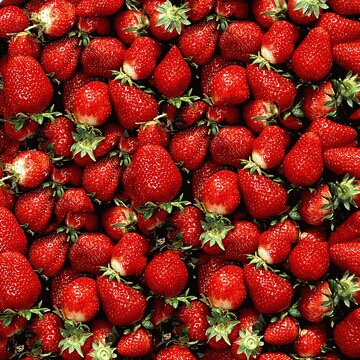
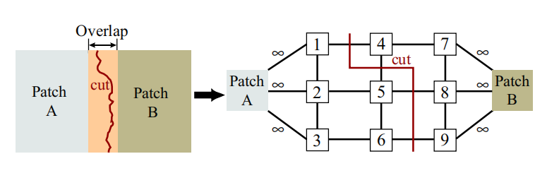
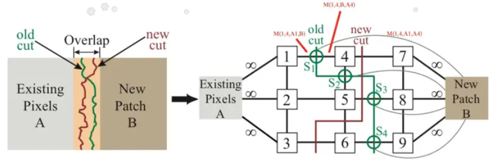
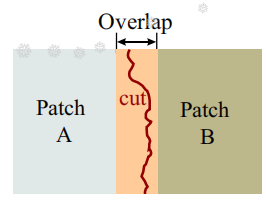

## **【Report】基于图割算法的图像纹理合成 Graphcut Textures: Image Synthesis Using Graph Cuts **

### **一：【概述】**

C++ 基于 OpenCV 库和最大流最小割算法实现图像纹理合成。

**运行环境**：Visual Studio 2022、OpenCV–4.9.0

**目标**：输入一张图像，通过复制、堆叠等方式生成一张指定大小的纹理图。

<center class="half">
    
    <font size=40>→<font/>
    
</center>

### **二：【算法】**

#### **1.【前置理论 】**

- **割**：对一个网络流图 $G=(V,E)$，将所有点划分为 $S$ 和 $T=V-S$ 两个集合，其中源点 $st\in S$、汇点 $ed\in T$。  
- **最小割**：最小化 $\sum_{a\in S,b\in T}c(u,v)$，即从 $S$ 集合到 $T$ 集合所有边的容量之和。  

#### **2.【图像合成】**

- **两图拼合**：将两张输入图 $\boldsymbol A$、$\boldsymbol B$ 交叉摆放，在交叉部分中寻找一条缝隙seam（对应图中的cut割线），缝隙左边部分都使用 $\boldsymbol A$ 图像素，右边部分都使用 $\boldsymbol B$ 图像素。  
- **最小化代价**：我们要让缝隙尽量不明显，也即最小化图中割线总代价。可转化为图最小割问题。  
- **模型建立**：  
  
  > **源点汇点**：划分给 $S$ 集合的像素点使用 $\boldsymbol A$ 图，划分给 $T$ 集合的像素点使用 $\boldsymbol B$ 图。  
  > **割边容量**：当一条边 $u-v$ 被割开，意味着 $u,v$ 两点将划分给不同集合，也即使用不同图像上的像素。此时会产生一定代价，也即容量。  
  > **价值函数**：设 $\boldsymbol A(s),\boldsymbol B(s)$ 分别表示点 $s$ 使用 $\boldsymbol A,\boldsymbol B$ 图像素时的颜色。取方格图上个相邻的点 $s,t$，则两点之间割边的代价定义为： $c(u,v)=M(s,t,\boldsymbol A,\boldsymbol B)=||\boldsymbol A(s)-\boldsymbol B(s)||+||\boldsymbol A(t)-\boldsymbol B(t)||$，其中 $||\cdot||$ 为向量范数（维度为颜色通道数）。  
  > **最小割**：总代价 $\sum\limits_{s\ use\ \boldsymbol A,t\ use\ \boldsymbol B}M(s,t,\boldsymbol A,\boldsymbol B)=\sum_{u\in S,v\in T}c(u,v)$ 。



#### **3.【纹理合成】**

- **多图拼合**：有新图像 $\bold{new} \ \bold{patch}$ 加入拼合时，需要记录原先两图拼合时的缝隙位置old_seam 及代价。综合考虑选择一条新的缝隙。  
  
  > **旧图** + $\bold{old} \ \bold{patch}$ = **现图**（上次拼合的输出，图中包含old_seam）
  > **现图** + $\bold{new} \ \bold{patch}$ = ？？（本次拼合的输出）
  
- **记录旧缝**：用 $\boldsymbol P_s$ 表示“现图”中 $s$ 点使用的像素来自哪张图（**旧图**或者 $\bold{old} \ \bold{patch}$）。  

- **缝节点**：在 old_seam 的每条割边 $s-t$ 位置新建节点 $node$，连接三条边 $s-node$、$node-t$、$node-ed$。
  
> | 边   | 代价 | 代价含义 | 割掉该边的含义 |
> | :----: | :----: | :----: | :----: |
> | $s-node$ | $M_1=M(s,t,\boldsymbol P_s,\bold{new})$ | $s$ 使用**现图**、$t$ 使用 $\bold{new}$ 的代价 |缝隙还在，但 $t$ 点用的图变了|
> | $node-t$ | $M_2=M(s,t,\bold{new},\boldsymbol P_t)$ | $s$ 使用 $\bold{new}$、$t$ 使用**现图**的代价 |缝隙还在，但 $s$ 点用的图变了|
> | $node-ed$ | $M_3=M(s,t,\boldsymbol P_s,\boldsymbol P_t)$ | $s$ 使用**现图**、$t$ 使用**现图**的代价（即old_seam代价） |旧缝和像素都保留|
> $M_1,M_2,M_3$ 验证满足三角形不等式，所以三边最多只会割一条。
>
> 若三边都未割，则 $node,s,t$ 三点都划在 $T$ 集合，也即 $s,t$ 两点都使用 $\bold{new} \ \bold{patch}$



<div STYLE="page-break-after: always;"></div>
### **三：【代码结构】**

#### **0.【前置代码】**

- 最小割算法：[maxflow-v3.01](https://vision.cs.uwaterloo.ca/code/) 。

```cpp
#include "graph.h"
#define GraphType Graph<double,double,double>
GraphType *G=new GraphType(V,E);//参数为预估的点集大小、边集大小

G->add_node(n);//增加n个节点
int id=G->add_node();//新增一个节点并返回编号

G->add_tweights(x,1,2);//源点向节点x连边容量为1，节点x向汇点连边容量为2

G->add_edge(x,y,3,4);//x向y连边容量为3，y向x连边为4

double flow=G->maxflow();//求最大流

if(G->what_segment(x)==GraphType::SOURCE);//如果节点x划分在S集合
if(G->what_segment(x)==GraphType::SINK);//如果节点x划分在T集合
```

#### **1.【主要框架】**

```cpp
class TextureSynthesis_by_GraphCut{//基于图割的纹理合成
private:
    
    int *vis;//记录输出图中每个位置是否有像素
    int *xpos,*ypos;//记录输出图中每个位置使用的像素在input图中的位置，用来表示P_s
    
    //rule=0未知，rule=1使用现图，rule=2使用patch图
    T *rule; //记录要求必须使用某图（用以处理(4)-(2)矛盾）
    
    //d维向量范数（平方和）
    T _norm(Img &A,int x_s,int y_s,Img &B,int x_t,int y_t);//计算 ||A(s)-B(t)||

    //在输入图像中选取以(in_stx,in_sty)为起点、大小为xsize*ysize的部分 作为patch，合成到输出图像中以(out_stx,out_sty)为起点的位置
    bool _Synthesis(int xsize,int ysize,int in_stx,int in_sty,int out_stx,int out_sty);

```

- **算法主框架**：在输入图中框选部分区域作为patch，融合到原图中的某个位置。重复这个过程。

```cpp
class TextureSynthesis_by_GraphCut{//基于图割的纹理合成
public:
    //输入图像pic_in，输出大小为out_height*out_width的图像pic_out
    //patch_size：纹理合成时每次框择的patch图大小
    bool TSbG(cv::Mat &pic_in,cv::Mat &pic_out,int out_height,int out_width,int out_dim,int patch_size=32);
```

#### **2.【实现细节】**

- 在计算 $M_1$ 时，可能会遇到 $\boldsymbol P_s$ 图中不存在对应 $t$ 点的情况（$s$ 刚好在 $\boldsymbol P_s$ 的边界线上），此时 $t$ 点对应范数不计算。即 $M_1(s,t,\boldsymbol P_s,\bold{new} \ \bold{patch})=||\boldsymbol P_s(s)-\bold{new} \ \bold{patch}(s)||$ 。

- 用 `xpos(s)` 和 `ypos(s)` 表示 $\boldsymbol P_s$ 图中 $s$ 节点像素在输入图中的位置（纹理合成任务中所有 patch 图均框选自输入图），默认初始化为 $-1$ 。

- 某些边界点可能会要求必须使用某张图，用连向源点或汇点的无穷容量边将其绑定在 $S$ 或 $T$ 集合。
  > 
  > (1).**现图**中的空节点。要求使用 $\bold{new}\ \bold{patch}$（对应右边区域）
  > (2).**现图**与 $\bold{new}\ \bold{patch}$ 重叠部分中靠近**现图**方向的边界。要求使用**现图**（对应中间重叠区域的左边界线）
  > (3).**现图**与 $\bold{new}\ \bold{patch}$ 重叠部分中靠近 $\bold{new}\ \bold{patch}$ 方向的边界。要求使用 $\bold{new}\ \bold{patch}$（对应中间重叠区域的右边界线）
  > (4).**现图**中非空，且处于 $\bold{new}\ \bold{patch}$ 的边界。要求使用 **现图**（对应中间重叠区域的上下边界线）
  >
  > 注：(4)可完全包含(2)，若(4)与(3)矛盾时优先遵循(4)使用 **现图**（对应中间重叠区域的右上点和右下点）

```cpp
for(int i=0;i<xsize;++i)
    for(int j=0;j<ysize;++j)
        if(!vis[(i+out_stx)*out_w+(j+out_sty)])//现图中为空
			rule[i*ysize+j]=2,G->add_tweights(i*ysize+j,0,inf);//现图中还没有信息，要求使用patch图，用inf边使其进入汇点集合
		else if(!i||!j||i==xsize-1||j==ysize-1)//现图不为空，且为patch图边界点
    		rule[i*ysize+j]=1,G->add_tweights(i*ysize+j,inf,0);//要求使用现图，用inf边使其进入源点集合
```

```cpp
//横边 (x,y) <-> (x,y+1)
for(int i=0,ix=in_stx,px=out_stx;i<xsize;++i,++ix,++px)
    for(int j=0,iy=in_sty,py=out_sty;j<ysize-1;++j,++iy,++py){
        int s=i*ysize+j,t=i*ysize+j+1;
        if(!vis[px*out_w+py]){//现图中左点为空（空点一定使用patch图）
            if(!vis[px*out_w+py+1])//现图中右点为空
                ;//一定都使用patch图，所以一定都在相同集合，无需连边
            else{//现图中右点不为空
                if(rule[t]==1);//前面已经要求用现图了，优先使用现图
                else rule[t]=2,G->add_edge(s,t,inf,inf);//右点属于重叠部分靠近patch图的边界点，要求使用patch图（用inf边使两点进入相同集合）
            }
        }
        else{//现图中左点不为空
            if(!vis[px*out_w+py+1]){//现图中右点为空（空点一定使用patch图）
                if(rule[s]==1);//前面已经要求用现图了，优先使用现图
                else rule[s]=2,G->add_edge(s,t,inf,inf);//左点属于重叠部分靠近patch图的边界点，要求使用patch图（用inf边使两点进入相同集合）
            }
            else{//现图中右点不为空
            	int xpos_s=xpos[px*out_w+py],ypos_s=ypos[px*out_w+py];
                // P_s图：上一次的合成结果（现图）中，s点用的是哪个图（旧图或者old patch）
                int xpos_t=xpos[px*out_w+py+1],ypos_t=ypos[px*out_w+py+1];
                // P_t图：上一次的合成结果（现图）中，t点用的是哪个图（旧图或者old patch）
                
                if(xpos_s==-1||xpos_t==-1||(xpos_s==xpos_t&&ypos_s+1==ypos_t)){//首次合成，或者这里没有seam（即P_s==P_t）
                    // 代价 M(s，t，现图，patch图)
                    T M=norm[s]+norm[t]; G->add_edge(s,t,M,M);
                }
                else{//有旧合成信息，且有old_seam（即P_s!=P_t）
                	...
                }
            }
//竖边 (x,y) <-> (x+1,y)
...
```

#### **3.【patch选择和拼合位置】**

##### **(0).【平铺】**

- 首先使用 patch 图将空白输出图填满。

```cpp
bool TSbG(cv::Mat &pic_in,cv::Mat &pic_out,int out_height,int out_width,int out_dim,int patch_size=32);
	...
    //【平铺布满输出图】
    for(int out_stx=0;out_stx<out_h;out_stx+=patch_size){
        for(int out_sty=0;out_sty<out_w;out_sty+=patch_size){
            int xsize=std::min(patch_size,out_h-out_stx);
            int ysize=std::min(patch_size,out_w-out_sty);
            int in_stx=rand()%(in_h-xsize),in_sty=rand()%(in_w-ysize); //在输入图中随机选取区域作为patch
            _Synthesis(xsize,ysize,in_stx,in_sty,out_stx,out_sty,++O);
        }
    }

    //【优化合成细节】
    ...
```

##### **(1).【Random Placement】**

- **Random Placement**：在输入图中随机框选区域作为patch 图，在输出图中随机选择位置摆放。

```cpp
// 完全随机 Random Placement
int rand_O=0;
while(++rand_O<=100){
    int xsize=patch_size,ysize=patch_size;
    int out_stx=rand()%(out_h-xsize),out_sty=rand()%(out_w-ysize);
    int in_stx=rand()%(in_h-xsize),in_sty=rand()%(in_w-ysize);
    _Synthesis(xsize,ysize,in_stx,in_sty,out_stx,out_sty);
}
```

##### **(2).【Sub-MinSSD】**

- 给定输出图区域，在输入图中寻找对应最佳匹配区域作为 patch 图。
  
  > **匹配度** $SSD$ 定义为对应像素作差后的范数之和。
  > $SSD$ 越小，匹配程度越好。$SSD$ 越大，匹配程度越差。
  > 实际计算时只考虑中间部分子区域的 $SSD$。

```cpp
//计算匹配度SSD
inline int _calc_SSD(T &SSD_min,int xsize,int ysize,int in_stx,int in_sty,int out_stx,int out_sty,int findmin,int Area=0){
    T SSD=0;int bordx=(xsize>=8?Area*xsize/4:0),bordy=(ysize>=8?Area*ysize/4:0);//边界（只计算中间部分子区域的SSD）
    for(int i=bordx;i<xsize-bordx;++i)
        for(int j=bordy;j<ysize-bordy;++j){
            int px=i+out_stx,py=j+out_sty;
            if(vis[px*out_w+py])
                SSD+=_norm(imgin,i+in_stx,i+in_sty,imgout,px,py);
            if(findmin&&SSD>SSD_min)return 0;//剪枝
        }
    SSD_min=SSD;
    return 1;
}
//SubMinSSD：在输入图当中搜寻一个patch，将其与给定输出图比较，计算匹配度SSD
inline T _FindPatch_MinSSD(int xsize,int ysize,int &in_stx,int &in_sty,int out_stx,int out_sty,double limit=1,int Area=0){
    //若Area=1，则只计算中间部分四分之一子区域的SSD
    T SSD_min;_calc_SSD(SSD_min,xsize,ysize,in_stx,in_sty,out_stx,out_sty,0);
    for(int x=0;x<in_h-xsize;++x)
        for(int y=0;y<in_w-ysize;++y)
            if(_calc_SSD(SSD_min,xsize,ysize,x,y,out_stx,out_sty,1,Area))
                in_stx=x,in_sty=y;
    return SSD_min;
}
```

- 先随机选择摆放位置，然后寻找中间子区域的最佳匹配作为 patch。

```cpp
// 部分随机 + SubMinSSD
int rand_O=0;
while(++rand_O<=100){
    int xsize=patch_size,ysize=patch_size;
    int out_stx=rand()%(out_h-xsize),out_sty=rand()%(out_w-ysize);
    int in_stx=rand()%(in_h-xsize),in_sty=rand()%(in_w-ysize);
    _FindPatch_MinSSD(xsize,ysize,in_stx,in_sty,out_stx,out_sty,1,1);
    _Synthesis(xsize,ysize,in_stx,in_sty,out_stx,out_sty);
}
```

##### **(3).【Mix】**

- 将两种方法随机混合使用。

```cpp
// 完全随机 Random Placement / 部分随机 + SubMinSSD / Mix 两种混合使用
int rand_O=0;
while(++rand_O<=100){
    int xsize=patch_size,ysize=patch_size;
    int out_stx=rand()%(out_h-xsize),out_sty=rand()%(out_w-ysize);
    int in_stx=rand()%(in_h-xsize),in_sty=rand()%(in_w-ysize);
    if(rand()%2)
        _FindPatch_MinSSD(xsize,ysize,in_stx,in_sty,out_stx,out_sty,1,1);
    _Synthesis(xsize,ysize,in_stx,in_sty,out_stx,out_sty);
}
```

### **四：【测试】**

*（左边为GIF图像，pdf文件中无法正常显示）*

- 输入图像 $170*220$，输出图像 $256*256$，`patch size=128`，运行 $50$ 轮次 Random Placement 输出结果：  

  

- 输入图像 $170*220$，输出图像 $256*256$，`patch size=128`，运行 $50$ 轮次 Sub-MinSSD 输出结果：  

 

- 输入图像 $170*220$，输出图像 $256*256$，`patch size=128`，运行 $100$ 轮次 Mix 输出结果：  

 

### **五：【To be Continued】**

- Sub-Patch Matching

- Entire Patch Matching

### **六：【参考文献】**

- *Graphcut Textures: Image and Video Synthesis Using Graph Cuts* [【项目主页】](https://sites.cc.gatech.edu/cpl/projects/graphcuttextures/#rotper)

- [最大流最小割算法 maxflow-v3.01](https://vision.cs.uwaterloo.ca/code/)

- [Zhihu - 如何通过缝隙拼接图像](https://www.zhihu.com/tardis/bd/art/62245480?source_id=1001)

- [Github - ZQlib](https://github.com/zuoqing1988/ZQlib/tree/master)